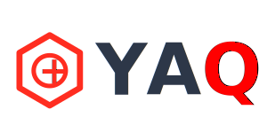

# YAQ - Yet Another Quiosco

**YAQ** es un proyecto de software en el marco de las Prácticas Profesionalizantes III de la carrera Tecnicatura Superior en Análisis de Sistemas y Dessarrollo de Software en el Instituto de Enseñanza Superior Nº 6017 "_Prof. Amadeo R. Sirolli_".

El proyecto utiliza el [framework Laravel](https://laravel.com/), un conjunto de herramientas y recursos que permiten desarrollar aplicaciones web de manera rápida y sencilla en el [lenguaje de programación PHP](https://www.php.net/).

## Resumen

Aplicación web orientada a simplificar la gestión cotidiana de un quiosco: administración de productos, registro de ventas, seguimiento de clientes y generación de reportes. Pensada tanto para propietarios como para empleados, busca centralizar las operaciones del negocio en una herramienta práctica y accesible.

## Requisitos

- PHP 8+
- Composer 2+
- Laravel 13+
- Node.js v24+
- NPM v11+
- MySQL/MariaDB
- Servidor web (Apache, Nginx o similares)

## Configuración & Despliegue

Consulte [BUILD.md](./BUILD.md) para obtener instrucciones detalladas sobre cómo configurar y desplegar la aplicación.

## Equipo

- Serna, Nicolas Abel
- Yurquina, Miguel Luciano
- Wayar, Leandro Nahuel
- Miranda, Emmanuel Rodrigo
- Yucra, Enzo Rafael
- Basualdo, David
